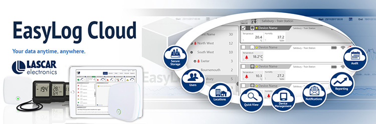

# Home Assistant EasyLog Cloud

[![GitHub Release][releases-shield]][releases]
[![hacs][hacsbadge]][hacs]
[![BuyMeCoffee][buymecoffeebadge]][buymecoffee]

An unofficial Home Assistant custom component for integrating EasyLog Cloud devices.

Monitor indoor environmental conditions using [Lascar Electronics](https://lascarelectronics.com/) EL-MOTE and EL-WiFi [EasyLog Cloud](https://lascarelectronics.com/software/easylog-software/easylog-cloud/) devices, such as:

- EL-IOT-CO2
- EL-WEM+

This integration pulls data from [EasyLog Cloud](https://easylogcloud.com) via web scraping every minute and presents it in Home Assistant.

## Features

- Automatically discovers and lists all linked EasyLog Cloud devices
- Exposes sensors like temperature, humidity, CO₂, VOC, particulates, air quality, and pressure
- Adds diagnostic sensors: WiFi signal, MAC address, firmware version, SSID, last updated
- Automatically refreshes every 60 seconds

> Requires valid EasyLog Cloud username and password.

---

## Installation

### Via HACS (recommended)

1. In Home Assistant, go to **HACS → Integrations → "+" → "Custom repositories"**
2. Add this repository URL: `https://github.com/Cadabena/ha-easylog-cloud` and select **Integration** as the category
3. After adding, search for **"EasyLog Cloud"** in HACS and install it
4. Restart Home Assistant
5. Go to **Settings → Devices & Services → "+" → EasyLog Cloud**
6. Enter your EasyLog Cloud credentials

### Manual

1. Copy this repo into `custom_components/ha-easylog-cloud` in your Home Assistant config
2. Restart Home Assistant
3. Follow the same steps as above to add the integration

After setup, sensors will be automatically created for each supported measurement per device.

---

## Configuration

All configuration is done via the Home Assistant UI (no YAML required).

---

## Contributions

Contributions are welcome! Please see the [CONTRIBUTING.md](CONTRIBUTING.md) file.

This project was generated using the [Home Assistant Custom Component Cookiecutter](https://github.com/oncleben31/cookiecutter-homeassistant-custom-component) and heavily modified for actual integration logic.

---

[integration_blueprint]: https://github.com/custom-components/integration_blueprint
[black]: https://github.com/psf/black
[black-shield]: https://img.shields.io/badge/code%20style-black-000000.svg?style=for-the-badge
[buymecoffee]: https://www.buymeacoffee.com/Cadabena
[buymecoffeebadge]: https://img.shields.io/badge/buy%20me%20a%20coffee-donate-yellow.svg?style=for-the-badge
[commits-shield]: https://img.shields.io/github/commit-activity/y/Cadabena/ha-easylog-cloud.svg?style=for-the-badge
[commits]: https://github.com/Cadabena/ha-easylog-cloud/commits/main
[hacs]: https://hacs.xyz
[hacsbadge]: https://img.shields.io/badge/HACS-Custom-orange.svg?style=for-the-badge
[license-shield]: https://img.shields.io/github/license/Cadabena/ha-easylog-cloud.svg?style=for-the-badge
[releases-shield]: https://img.shields.io/github/release/Cadabena/ha-easylog-cloud.svg?style=for-the-badge
[releases]: https://github.com/Cadabena/ha-easylog-cloud/releases

**Topics:** home-assistant, easylog, iot, cloud, integration
